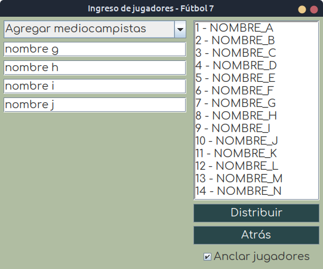
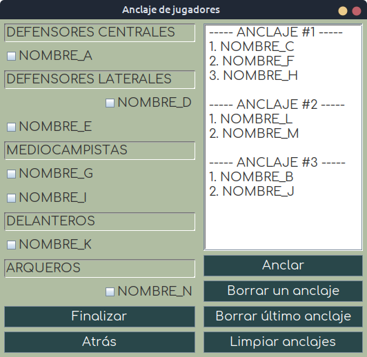
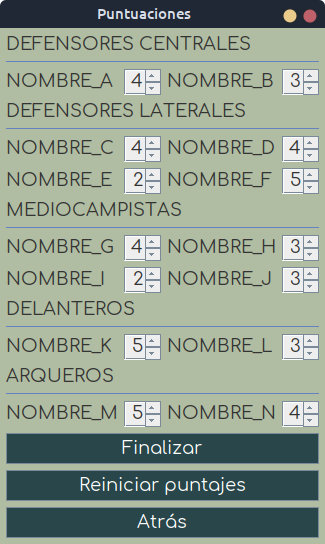
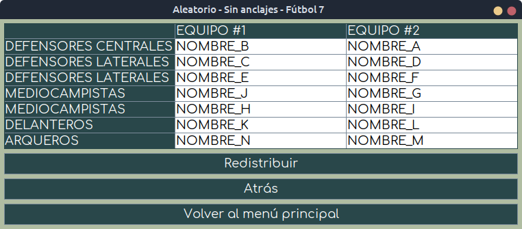
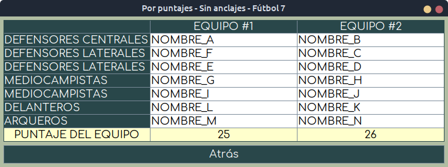

# Armame el doparti v3.0 ⚽


```
Release date: TBD
```


## 📜 Índice
- [¿Qué es?](https://github.com/akmsw/armame-el-doparti#-qu%C3%A9-es)
- [Requisitos](https://github.com/akmsw/armame-el-doparti#-requisitos)
    - [Java](https://github.com/akmsw/armame-el-doparti#-java)
        - [Versión mínima](https://github.com/akmsw/armame-el-doparti#versi%C3%B3n-m%C3%ADnima)
        - [Versión recomendada](https://github.com/akmsw/armame-el-doparti#versi%C3%B3n-recomendada)
- [Descarga](https://github.com/akmsw/armame-el-doparti#-descarga)
- [Instalación y ejecución](https://github.com/akmsw/armame-el-doparti#%EF%B8%8F-instalaci%C3%B3n-y-ejecuci%C3%B3n)
- [¿Cómo se usa?](https://github.com/akmsw/armame-el-doparti#-c%C3%B3mo-se-usa)
- [Nuevas funcionalidades](https://github.com/akmsw/armame-el-doparti#-nuevas-funcionalidades)
    - [Anclaje de jugadores](https://github.com/akmsw/armame-el-doparti#-anclaje-de-jugadores)
- [Mejoras](https://github.com/akmsw/armame-el-doparti#-mejoras)
- [Solución a problemas frecuentes](https://github.com/akmsw/armame-el-doparti#%EF%B8%8F-soluci%C3%B3n-de-problemas-comunes)
    - [En Linux](https://github.com/akmsw/armame-el-doparti#-en-linux)
- [Seguimiento](https://github.com/akmsw/armame-el-doparti#-seguimiento)
- [Capturas de pantalla](https://github.com/akmsw/armame-el-doparti#-capturas-de-pantalla)

## 🔎 ¿Qué es?
Construido completamente en Java y refactorizado en su totalidad, la nueva versión de este programa ofrece una rápida e intuitiva manera de generar equipos para partidos de fútbol 7, ya sea con distribución aleatoria de jugadores o basada en puntuaciones. Se ofrece la posibilidad de "anclar" dos o más jugadores entre sí, garantizando de esta forma que quedarán en el mismo equipo sin importar la distribución elegida.

## 📦 Requisitos
### ☕ Java
- #### Versión mínima
    🟡 [Java 11](https://www.oracle.com/ar/java/technologies/javase/jdk11-archive-downloads.html)
- #### Versión recomendada
    🟢 [Java 17](https://www.oracle.com/java/technologies/javase/jdk17-archive-downloads.html) *(o más reciente)*

## 📥 Descarga
La versión estable más reciente del programa se encuentra disponible para su descarga en la sección [releases](https://github.com/akmsw/armame-el-doparti/releases) de este proyecto.

## ▶️ Instalación y ejecución
Más allá de los requisitos listados, no hace falta ninguna instalación para correr este programa.\
Una vez descargado el archivo con extensión ***jar***, e independientemente del sistema operativo, podemos dirigirnos a la carpeta donde está situado y abrirlo con un simple *doble click*. En caso de estar en Linux y que el programa no se abra, véase la sección de [solución a problemas frecuentes en linux](https://github.com/akmsw/armame-el-doparti#-en-linux).\
Una alternativa es abrir una terminal dentro de la carpeta contenedora del archivo y ejecutar el comando:
```bash
java -jar nombre_del_archivo.jar
```

## 📝 ¿Cómo se usa?

El usuario podrá generar sus equipos ingresando los nombres de los jugadores a sortear en cada posición.\
La distribución estándar de jugadores por equipo es:
- **Defensores centrales**: 1
- **Defensores laterales**: 2
- **Mediocampistas**: 2
- **Delanteros**: 1
- **Arqueros**: 1

Una vez ingresados los nombres de todos los jugadores a repartir en cada posición para ambos equipos, se podrá seleccionar si distribuirlos de manera aleatoria, o en base a una puntuación. Si se elige la segunda opción, le será solicitado al usuario una puntuación de 1 ***(mal jugador)*** a 5 ***(excelente jugador)*** para cada jugador ingresado. Finalmente, se armarán los equipos de la manera más equitativa posible.\
Si los jugadores se reparten en base a sus puntuaciones, la distribución óptima será única. Si se decide distribuirlos de manera aleatoria, se podrán redistribuir tantas veces como se quiera hasta estar conforme.

## ⭐ Nuevas funcionalidades
### 🔗 Anclaje de jugadores
El objetivo de esta funcionalidad es la de indicarle al programa que al menos dos jugadores seleccionados por el usuario deberán pertenecer al mismo equipo sin importar la distribución que se elija para el resto. El número máximo posible de jugadores a anclar a un mismo equipo es de 6, garantizando así que siempre queden al menos dos jugadores sin anclar para poder realizar alguna distribución.\
Para esto, se proporciona un checkbox rotulado con el texto "*Anclar jugadores*" en la ventana de ingreso de nombres. Si el usuario tilda este checkbox, luego de seleccionar el método de distribución de jugadores se le presentará una ventana en la que habrá una lista con todos los nombres ingresados y su respectivo checkbox. Los jugadores cuyo checkbox esté tildado serán anclados al mismo equipo.\
No se podrán anclar a un mismo equipo todos los jugadores de un mismo tipo (por ejemplo, si se anclan todos los mediocampistas para un mismo equipo, el otro equipo no tendrá mediocampistas y esto no es posible). Lo mismo sucede con anclar a un mismo equipo más de la mitad de jugadores registrados para una posición particular.

## ✅ Mejoras

- GUI mucho más cómoda, intuitiva y agradable que en versiones anteriores.
- Arreglo de importantes bugs de la GUI.
- Se implementaron algoritmos más eficientes para las distribuciones.
- Se prescindió de clases y métodos que no eran vitales, mejorando significativamente la modularización del código, su mantenibilidad y la velocidad de ejecución del programa.
- Implementación de expresiones regulares para alivianar tareas.
- Importantes cambios de refactorización.

## 🛠️ Solución a problemas frecuentes
### 🐧 En Linux
- Si el archivo ***jar*** no se ejecuta al hacerle doble click, seguir los siguientes pasos:
    - Click derecho sobre el archivo descargado
    - Propiedades
    - Abrir con...
    - En el campo de ingreso de comando personalizado, ingresar: `java -jar`
    - Seleccionar como opción predeterminada para ejecución de este tipo de archivos

## 📋 Seguimiento
Para estar al tanto del desarrollo del programa, se puede visitar el [panel de seguimiento](https://github.com/users/akmsw/projects/2) del mismo y ver en qué se está trabajando, qué está por añadirse/modificarse, y qué cosas se han terminado de implementar.

## 📸 Capturas de pantalla
\
*Ventana principal*

\
*Ventana de ingreso de nombres*

\
*Ventana de anclajes*

\
*Ventana de puntuaciones*

\
*Ventana de muestra de resultado de distribución aleatoria sin anclajes*

\
*Ventana de muestra de resultado de distribución aleatoria con tres anclajes distintos*

\
*Ventana de muestra de resultado de distribución por puntuaciones sin anclajes*